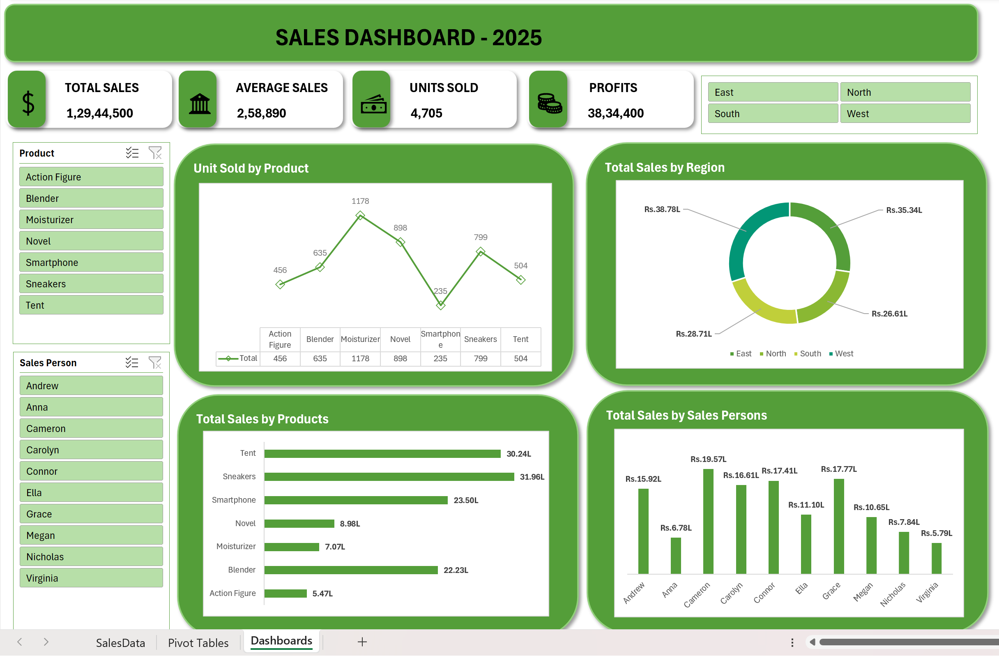

# Excel Dashboard Project

## 📊 Overview
This project showcases a comprehensive **Excel Dashboard** designed to visualize and analyze key data insights effectively. The dashboard is tailored to present complex information in a simple and interactive format.

## 🖥️ Dashboard Preview

## 📋 Features
- Clean and interactive UI for data visualization.
- Dynamic charts and graphs to display insights.
- Automated data calculations using Excel formulas.
- Pivot tables for organized data representation.
- Conditional formatting for better data interpretation.

## 📂 Files Included
- `Excel_Dashboard.xlsx` - The main dashboard file.
- `README.md` - Project documentation (this file).

## 🚀 How to Use
1. Download the `Excel_Dashboard.xlsx` file.
2. Open it in **Microsoft Excel 2016** or later for full functionality.
3. Update the data source sheet if needed to reflect new data.
4. Interact with charts, filters, and visual elements for insights.

## 🛠️ Requirements
- **Microsoft Excel 2016** or newer for full compatibility.
- Basic knowledge of Excel functions for modifications.

## 📧 Contact
For questions or suggestions, feel free to reach out:
- 📩 Email: vthanush666@gmail.com
- 📞 Phone: +91 7397187850
